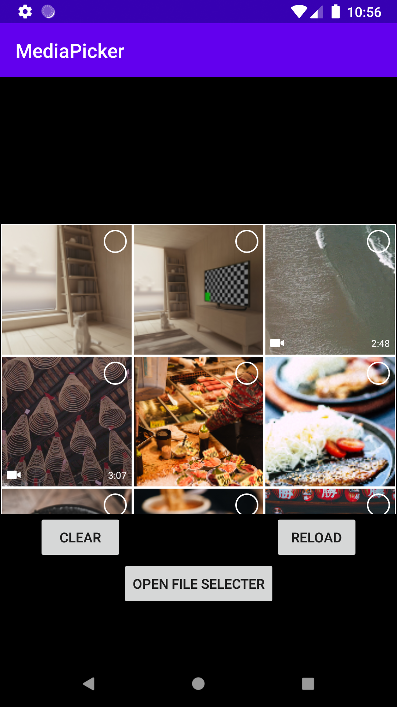

# MediaPicker

 

此 repositories 參考 Line/Instagram 製作畫面與功能，作為圖片/影片選擇器
使用：
1. RecyclerView：負責顯示預覽圖片及資訊
2. AsyncTask：負責製作/載入縮圖，避免因為圖面原檔過大造成記憶體不足，以及畫面更新時刷新緩慢

This repository is follow the UI of Line/Instagram to make pictures and functions, as a picture/video picker
With:
1. RecyclerView: Responsible for displaying preview pictures and information
2. AsyncTask: Responsible for making/loading thumbnails to avoid insufficient memory due to excessively large original files and slow refreshing when the screen is updated

畫面預覽(Preview)：

